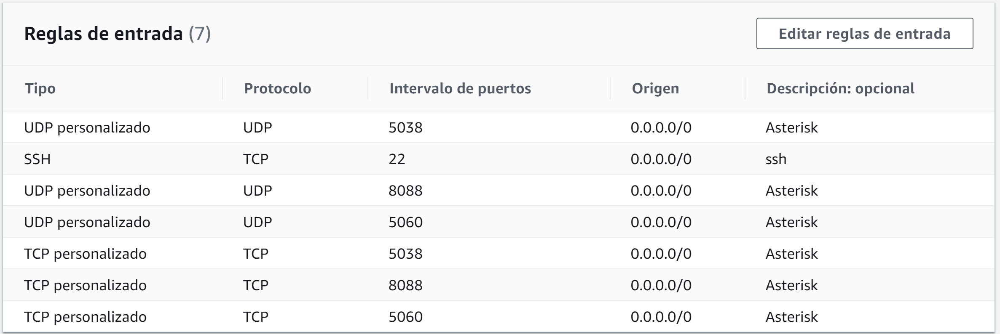
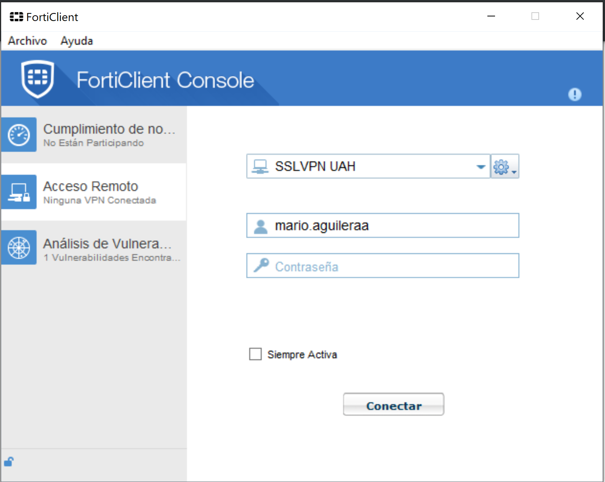
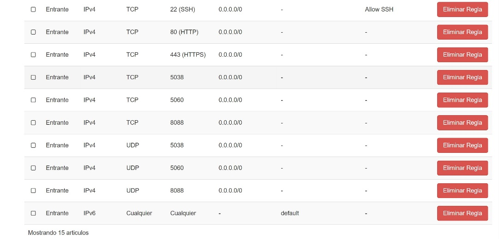

# Pasos previos
Para poder desplegar esta configuración, las siguientes líneas deben
de ser añadidas al archivo de configuración de ssh `~/.ssh/config`
(asumiendo que la clave de acceso para el servidor virtual remoto es
`amazon_free_1.pem` para la instancia de amazon y
`openstack_labredes.key` para la del openstack)

``` ssh-config
Host amazon_labredes
    User ubuntu
    HostName <the address that amazon gives you>
    Port 22
    IdentityFile ~/.ssh/amazon_free_1.pem
Host openstack_labredes
    User ubuntu
    HostName <the assigned floating ip>
    Port 22
    IdentityFile ~/.ssh/openstack_labredes.key
```

# Despliegue del servicio de Docker
Dado que la aplicación está empaquetada en un Dockerfile, la podemos
desplegar fácilmente con Ansible. Para poder hacer eso, tenemos que
escribir un playbook.

Dicho playbook se encuentra en el archivo [main.yml](./main.yml).
Después de especificar las configuraciones a desplegar, tenemos que
decirle a ansible los hosts en los que queremos hacer el despligue,
dichos hosts se especifican en el archivo [hosts](./hosts). Esto es
así porque en el directorio existe el archivo
[ansible.cfg](./ansible.cfg) y ahí está especificado que busque los
hosts en los que hacer el despliegue en el archivo hosts dentro del
directorio actual.

# Configuración AWS:
Para poder hacer uso de los servicios de la VM lo que hicimos fue
habilitar los puertos. En primer lugar fuimos a AWS donde tras
logearnos y acceder a nuestra clase donde desde la consola de EC2,
pulsando en Instancias, se puede ver un apartado llamado Grupos de
Seguridad, tras pulsar dicho sitio pulsamos en el primer enlace que
aparece en ese apartado, nos encontraremos que ha un apartado de
conexiones de entrada donde pulsando el botón de editar y añadimos los
protocolos y puertos necesarios, en nuestro caso el 5038, 8088, 5060
tanto TCP como UDP y el SSH en el puerto 22.



# Configuración OpenStack:
Por otro lado para poder realizar la interacción con la Nube Privada
tuvimos que iniciar sesión en nuestro caso con: FortiCLient para
acceder con la VPN de la universidad como se muestra en la figura de
abajo.



Una vez realizado con éxito el paso anterior nos fuimos a OpenStack
donde tras acceder con las credenciales que se nos dieron, siendo
nuestra clave la 001 entramos a poder habilitar los puertos de manera
análoga a la realizada en la nube pública de Amazon.


